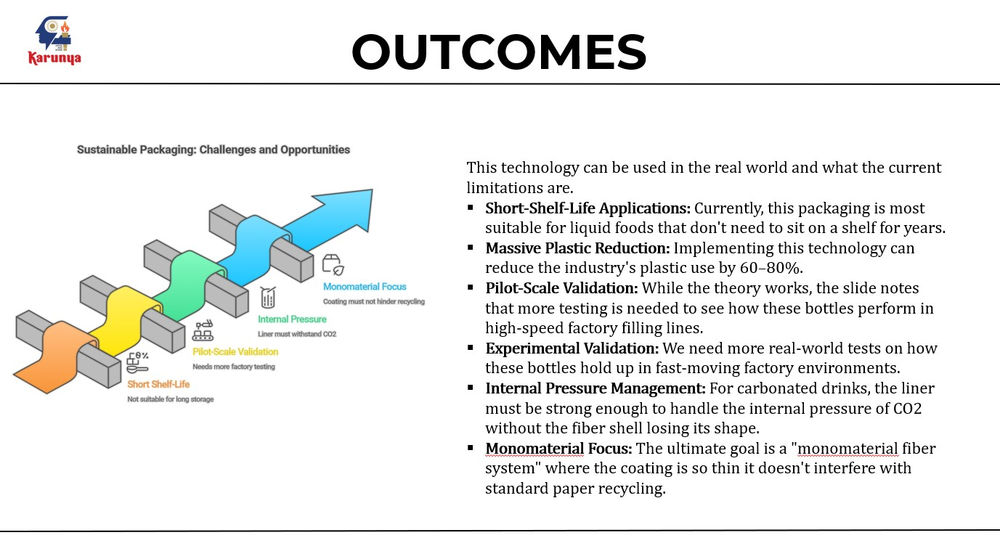

# 🌿 Technical Evaluation of Fiber-Based Packaging and Bio-Polymer Barriers for Liquid Food Applications

## 📌 Project Overview
This project presents a technical literature review evaluating the feasibility of fiber-based packaging combined with bio-polymer barrier technologies for liquid food applications such as beverages and dairy products.

The study focuses on sustainability, food safety, barrier performance, and industrial applicability of alternative packaging solutions to conventional plastic-based materials.

---

## 🎯 Objectives
- Analyze fiber-based packaging materials used in liquid food containment
- Evaluate bio-polymer barrier technologies for moisture, oxygen, and microbial protection
- Study food safety considerations in sustainable packaging systems
- Compare environmental impact with traditional plastic packaging
- Identify industrial feasibility and research gaps

---

## ❗ Problem Statement
Conventional plastic packaging contributes significantly to environmental pollution and long-term waste accumulation. Sustainable alternatives such as fiber-based packaging require advanced barrier technologies to ensure product stability and food safety when used for liquid foods.

---

## 🔬 Methodology
This study was conducted through a structured literature review approach:

- Analysis of research papers and industrial case studies
- Evaluation of fiber-based packaging materials
- Assessment of bio-polymer coating technologies
- Comparative analysis of barrier performance
- Review of food safety and regulatory compliance aspects

---

## 🛡 Food Safety Evaluation
The project evaluated packaging materials based on:

- Moisture barrier properties
- Oxygen transmission resistance
- Microbial contamination prevention
- Shelf-life stability support
- Compliance with food safety standards

---

## 📊 Key Findings
- Fiber-based packaging shows strong sustainability potential.
- Bio-polymer coatings improve barrier properties significantly.
- Proper coating combinations can support liquid food storage.
- Industrial adoption requires further material optimization and cost analysis.

---

## 🌱 Sustainability Impact
This research supports the transition toward eco-friendly packaging solutions that reduce plastic waste and promote circular economy practices in the food industry.

---

## 📷 Project Visual Summary
### Problem Statement

### Research Methodology

### Food Safety Evaluation

### Key Outcomes

### Conclusion

---

## 🧠 Skills Applied
- Scientific Literature Review
- Food Packaging Technology
- Food Safety Risk Assessment
- Sustainability Evaluation
- Technical Documentation

---

## 📚 Project Type
Academic Research Review

---

## 🚀 Future Scope
- Prototype development of fiber-based liquid packaging
- Advanced bio-polymer coating optimization
- Shelf-life testing using experimental validation
- Industrial scalability studies

---

## 👩‍🔬 Author
Pratheeksha Shalbin  
Food Processing Undergraduate  
Focus Areas: Sustainable Packaging, Food Safety, Product Development, Digital Tools in Food Systems

---

